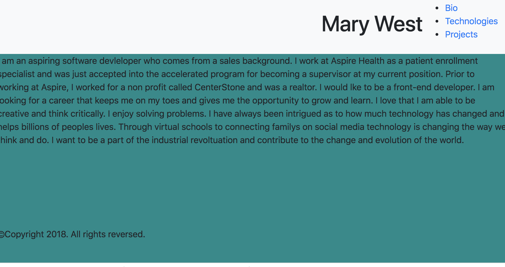

# personal-bio-site

## Description

This is the personal site we did that provides a short bio, all of the projects we have done at NSS, and includes the technologies we used. 

## Screenshot


## How to run this project
* Use npm to intall http-server in your terminal:
```sh
npm install -g http-server
```
* Run the server
```sh
hs -p 9999
```
* Open chrome and navigate to:
```
localhost:9999
```